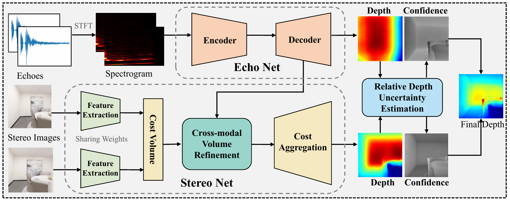

Code for *Stereo Depth Estimation with Echoes*, accepted at ECCV 2022.

**StereoEchoes Framework**



**Abstract**
Stereo depth estimation is particularly amenable to local textured regions while echoes have good depth estimations for global textureless regions, thus the two modalities complement each other. Motivated by the reciprocal relationship between both modalities, in this paper, we propose an end-to-end framework named *StereoEchoes* for stereo depth estimation with echoes. A Cross-modal Volume Refinement module is designed to transfer the complementary knowledge of the audio modality to the visual modality at feature level. A Relative Depth Uncertainty Estimation module is further proposed to yield pixel-wise confidence for multimodal depth fusion at output space. As there is no dataset for this new problem, we introduce two Stereo-Echo datasets named Stereo-Replica and Stereo-Matterport3D for the first time. Remarkably, we show empirically that our StereoEchoes, on Stereo-Replica and Stereo-Matterport3D, outperforms stereo depth estimation methods by 25%/13.8% RMSE, and surpasses the state-of-the-art audio-visual depth prediction method by 25.3%/42.3% RMSE.

If you use this code please cite:
```
@inproceedings{zhang_2022_ECCV,
title={Stereo Depth Estimation with Echoes},
author={Zhang, Chenghao and Tian, Kun and Ni, Bolin and Meng, Gaofeng and Fan, Bin and Zhang, Zhaoxiang and Pan, Chunhong},
booktitle={European Conference on Computer Vision (ECCV)},
year={2022}}
```

## Stereo-Echo Datasets
Please download Stereo-Replica and Stereo-Matterport3D datasets following the instructions [here](https://github.com/chzhang18/Stereo-Echo-Datasets).

## Requirements
```
python 3.7
PyTorch >= 1.1
torchvision >= 0.3
matplotlib
scikit-image
opencv
librosa
```

## Code Structure

 - datasets/: datasets preprocess (*data_io.py*) and dataloader for Stereo-Replica (*replica_dataset.py*) and Stereo-Matterport3D  (*mp3d_dataset.py*)
 - models/: StereoEchoes framework based on GwcNet (*gwcnet.py*) and loss functions (*loss.py*)
 - utils/: tool code for metrics
 - checkpoints/: pre-trained weights for Stereo-Replica datasets
 - scripts/: test scripts
 - test.py: test code for evaluations

## Command to evaluation
```
sh scripts/replica_test.sh
```

## Acknowledgements
This repository makes liberal use of code from [GwcNet](https://github.com/xy-guo/GwcNet) and [beyond-image-to-depth](https://github.com/krantiparida/beyond-image-to-depth).


